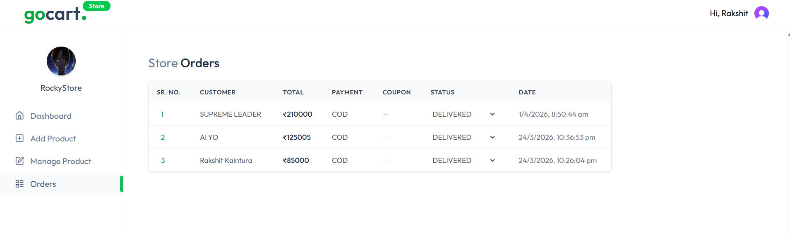

# GoCart: Amazon-Like E-Commerce Platform

Fast, polished, and production-ready e‑commerce starter showcasing seller workflows, admin tooling, secure Stripe checkout, and AI-driven review insights.

[](#) 
[](#) 
[](#)
[](CONTRIBUTING.md)

---

## Why this project matters

**GoCart** demonstrates how to build a modern marketplace front-to-back. It features multi-store support, role-based admin/seller experiences, secure payments, and actionable product intelligence. It addresses real-world production concerns—webhooks, background jobs, complex DB modeling, and AI-assisted UX—within a cohesive, deployable Next.js application.

### Highlights for Recruiters
- **Polished UI:** Responsive design for product listings, seller dashboards, and admin panels.
- **End-to-End Flows:** Complete lifecycle from adding a product to checkout and webhook reconciliation.
- **Real-world Integrations:** Seamlessly uses Stripe, ImageKit, OpenAI, and Inngest.
- **Pragmatic Architecture:** Built with Next.js App Router, Prisma ORM, and PostgreSQL.

---

## Visual Tour

### Home / Landing
<p align="center">
  
</p>

### Seller Experience
*Dashboard, Inventory Management, and Order Fulfillment*

| | |
| :---: | :---: |
|  |  |
| **Seller Dashboard** | **Inventory Management** |
|  |  |
| **Add New Product** | **Order Tracking** |

### Admin Control Panel
*Global Oversight, Store Management, and Coupons*

<p align="center">
  
  
  
</p>

### User Journey & Checkout
*Seamless flow from discovery to payment*

| | | |
| :---: | :---: | :---: |
|  |  |  |
| **Smart Cart** | **Secure Payment** | **Product Browsing** |
|  |  | |
| **Order History** | **GoCart+ Plus** | |

---

## Core Features

- **Next.js App Router:** Utilizing server components for fast SSR/SSG and secure server actions.
- **Robust Data Model:** Full Prisma schema covering Users, Stores, Products, Orders, Ratings, and Coupons.
- **Stripe Integration:** Checkout flows + webhook handling for secure payment reconciliation.
- **Multi-Role Dashboards:** Specialized views and permissions for Sellers and Administrators.
- **Image Optimization:** Integrated with ImageKit for performant asset delivery.
- **Background Jobs:** Powered by Inngest for event-driven, asynchronous tasks.
- **AI Insights:** Automated product review summarization using OpenAI (`lib/reviewInsights.js`).

---

## Tech Stack

- **Frontend:** Next.js 15 (App Router), React 19, Tailwind CSS, Lucide Icons
- **State Management:** Redux Toolkit, React-Redux
- **Backend:** Node.js, Prisma ORM
- **Database:** PostgreSQL
- **Services:** Stripe (Payments), ImageKit (Media), Inngest (Queueing), OpenAI (AI), Clerk (Auth)

---

## Quickstart

### Prerequisites
- Node.js 18+
- PostgreSQL instance (e.g., Neon)
- Stripe Account (for API keys)
- OpenAI Key (optional for AI summaries)

### Local Setup
1. **Clone the repository:**
   ```bash
   git clone [https://github.com/RakshitKaintura/AMAZON.git](https://github.com/RakshitKaintura/AMAZON.git)
   cd AMAZON
